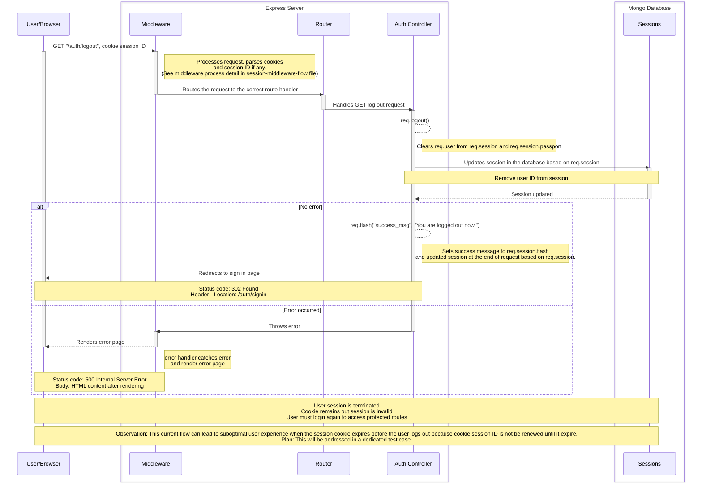

```mermaid
%%Log out request

sequenceDiagram
    participant U as User/Browser

    box Express Server
    participant M as Middleware
    participant R as Router
    participant AC as Auth Controller
    end

    box Mongo Database
    participant S as Sessions
    end

    %%flow
    %%send request
    U ->> M: GET "/auth/logout", cookie session ID
    activate U
    activate M

    %%middleware process
    note right of M: Processes request, parses cookies<br/>and session ID if any.<br/>(See middleware process detail in session-middleware-flow file)

    M ->> R: Routes the request to the correct route handler
    deactivate M
    activate R

    %route handler
    R ->> AC: Handles GET log out request
    deactivate R
    activate AC

    %%req.log out()
    AC --> AC: req.logout()
    note right of AC: Clears req.user from req.session and req.session.passport

    AC ->> S: Updates session in the database based on req.session
    activate S
    note over AC, S: Remove user ID from session
    S -->> AC: Session updated
    deactivate S

    alt No error
        AC --> AC: req.flash("success_msg", "You are logged out now.");
        note right of AC: Sets success message to req.session.flash<br/>and updated session at the end of request based on req.session.
        AC -->> U: Redirects to sign in page
        note over AC, U: Status code: 302 Found<br/>Header - Location: /auth/signin
    else Error occurred
        AC ->> M: Throws error
        activate M
        deactivate AC
        M -->> U: Renders error page
        deactivate M
        deactivate U
        note right of M: error handler catches error<br/> and render error page
        note over M, U: Status code: 500 Internal Server Error<br/>Body: HTML content after rendering
        
    end

    note over U, S: User session is terminated<br/>Cookie remains but session is invalid<br/>User must login again to access protected routes
    note over U, S: Observation: This current flow can lead to suboptimal user experience when the session cookie expires before the user logs out because cookie session ID is not be renewed until it expire.<br/>Plan: This will be addressed in a dedicated test case.

```