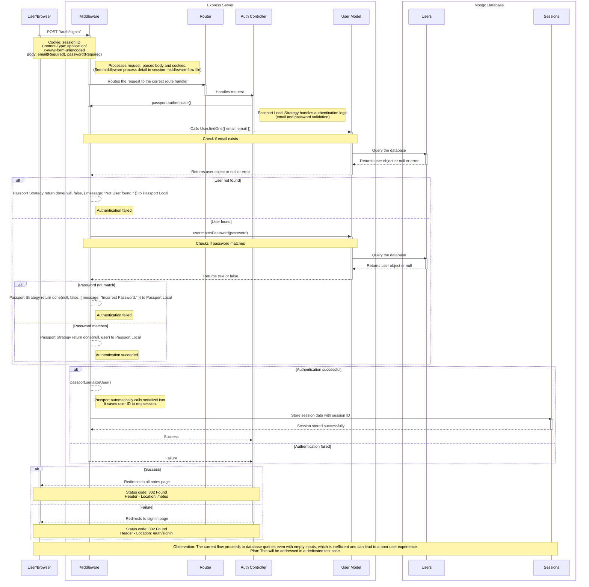

```mermaid
%%POST sign in form request

sequenceDiagram
    participant U as User/Browser

    box Express Server
    participant M as Middleware
    participant R as Router
    participant AC as Auth Controller
    participant MD as User Model
    end

    box Mongo Database
    participant Us as Users
    participant S as Sessions
    end

    %%flow
    %%Phase 1: User submits the sign up form
    U ->> M: POST "/auth/signin"
    activate U
    activate M
    note over U, M: Cookie: session ID<br/>Content-Type: application/<br/>x-www-form-urlencoded<br/> Body: email(Required), password(Required)
    
    %%Phase 2: Server processes

    %%middleware process
    note right of M: Processes request, parses body and cookies.<br/>(See middleware process detail in session-middleware-flow file)

    M ->> R: Routes the request to the correct route handler
    deactivate M
    activate R

    R ->> AC: Handles request
    deactivate R
    activate AC

    AC ->> M: passport.authenticate()
    activate M
    note right of AC: Passport Local Strategy handles authentication logic<br/>(email and password validation)
    
    %%Checks user credential
    %%check email
    M ->> MD: Calls User.findOne({ email: email })
    activate MD
    note over M, MD: Check if email exists
    MD ->> Us: Query the database
    activate Us
    Us -->> MD: Returns user object or null or error
    deactivate Us
    MD -->> M: Returns user object or null or error
    deactivate MD
    
    alt User not found
        M --> M: Passport Strategy return done(null, false, { message: "Not User found." }) to Passport Local
        note right of M: Authentication failed

    else User found
        M ->> MD: user.matchPassword(password)
        activate MD
        note over M, MD: Checks if password matches
        MD ->> Us: Query the database
        activate Us
        Us -->> MD: Returns user object or null
        deactivate Us
        MD -->> M: Returns true or false
        deactivate MD

        alt Password not match
            M --> M: Passport Strategy return done(null, false, { message: "Incorrect Password." }) to Passport Local
            note right of M: Authentication failed
        else Password matches
            M --> M: Passport Strategy return done(null, user) to Passport Local
            note right of M: Authentication suceeded
        end
    end

    alt Authentication successful
        M --> M: passport.serializeUser()
        note right of M: Passport automatically calls serializeUser.<br/>It saves user ID to req.session.
        M ->> S: Store session data with session ID
        activate S
        S -->> M: Session stored successfully
        deactivate S
        M -->> AC: Success

    else Authentication failed
        M -->> AC: Failure
    deactivate M
    end
    

    %%Phase 3: send response
    alt Success
        AC -->> U: Redirects to all notes page
        note over AC, U: Status code: 302 Found<br/>Header - Location: /notes
    else Failure
        AC -->> U: Redirects to sign in page
        deactivate AC
        deactivate U
        note over AC, U: Status code: 302 Found<br/>Header - Location: /auth/signin
    end

    note over U, S: Observation: The current flow proceeds to database queries even with empty inputs, which is inefficient and can lead to a poor user experience.<br/>Plan: This will be addressed in a dedicated test case.
    
```