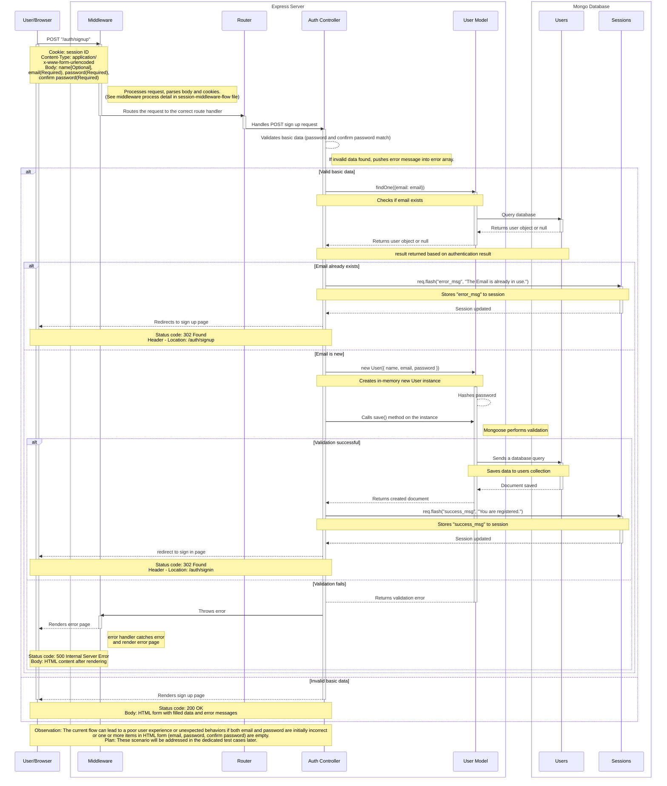

```mermaid
%%POST sign up form request

sequenceDiagram
    participant U as User/Browser

    box Express Server
    participant M as Middleware
    participant R as Router
    participant AC as Auth Controller
    participant MD as User Model
    end

    box Mongo Database
    participant Us as Users
    participant S as Sessions
    end

    

    %%flow
    %%Phase 1: User submits the sign up form
    U ->> M: POST "/auth/signup"
    activate U
    activate M
    note over U, M: Cookie: session ID<br/>Content-Type: application/<br/>x-www-form-urlencoded<br/> Body: name[Optional], <br/>email(Required), password(Required),<br/> confirm password(Required)
    
    %%Phase 2: Server processes

    %%middleware process
    note right of M: Processes request, parses body and cookies.<br/>(See middleware process detail in session-middleware-flow file)

    M ->> R: Routes the request to the correct route handler
    deactivate M
    activate R

    %%route handler
    R ->> AC: Handles POST sign up request
    deactivate R
    activate AC
    AC --> AC: Validates basic data (password and confirm password match)
    note right of AC: If invalid data found, pushes error message into error array.

    alt Valid basic data
        AC->> MD: findOne({email: email})
        activate MD
        note over AC, MD: Checks if email exists
        MD ->> Us: Query database
        activate Us
        Us -->> MD: Returns user object or null
        deactivate Us
        MD -->> AC: Returns user object or null
        deactivate MD
        note over AC, Us: result returned based on authentication result

        alt Email already exists
            AC ->> S: req.flash("error_msg", "The Email is already in use.")
            activate S
            note over AC, S: Stores "error_msg" to session
            S -->> AC: Session updated
            deactivate S
            AC -->> U: Redirects to sign up page
            note over AC, U: Status code: 302 Found<br/>Header - Location: /auth/signup
        else Email is new
            AC ->> MD: new User({ name, email, password })

            %%check data against expected model
            note over AC, MD: Creates in-memory new User instance
            activate MD
            MD --> MD: Hashes password 
            AC ->> MD: Calls save() method on the instance
            note right of MD: Mongoose performs validation
            
            alt Validation successful
                MD ->> Us: Sends a database query
                activate Us
                note over MD, Us: Saves data to users collection
                Us -->> MD: Document saved
                deactivate Us
                MD -->> AC: Returns created document
                AC ->> S: req.flash("success_msg", "You are registered.")
                activate S
                note over AC, S: Stores "success_msg" to session
                S -->> AC: Session updated
                deactivate S
                AC -->> U: redirect to sign in page
                note over AC, U: Status code: 302 Found<br/>Header - Location: /auth/signin
            else Validation fails
                MD --> AC: Returns validation error
                deactivate MD
                AC ->> M: Throws error
                activate M
                M -->> U: Renders error page
                deactivate M
                note right of M: error handler catches error<br/> and render error page
                note over M, U: Status code: 500 Internal Server Error<br/>Body: HTML content after rendering
                
            end
        end
        
    else Invalid basic data
         AC -->> U: Renders sign up page
         deactivate AC
         deactivate U
         note over AC, U: Status code: 200 OK<br/>Body: HTML form with filled data and error messages
         
    end
    
    note over AC, U: Observation: The current flow can lead to a poor user experience or unexpected behaviors if both email and password are initially incorrect<br/>or one or more items in HTML form (email, password, confirm password) are empty.<br/>Plan: These scenario will be addressed in the dedicated test cases later.
    
```