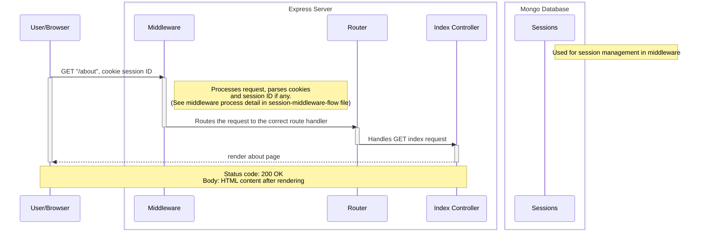

```mermaid
%%GET index page

sequenceDiagram
    participant U as User/Browser

    box Express Server
    participant M as Middleware
    participant R as Router
    participant IC as Index Controller
    end

    box Mongo Database
    participant S as Sessions
    end

    note right of S: Used for session management in middleware
    
    %%flow
    %%send request
    U ->> M: GET "/about", cookie session ID
    activate U
    activate M

    %%middleware process
    note right of M: Processes request, parses cookies<br/>and session ID if any.<br/>(See middleware process detail in session-middleware-flow file)

    M ->> R: Routes the request to the correct route handler
    deactivate M
    activate R

    %route handler
    R ->> IC: Handles GET index request
    deactivate R
    activate IC
    IC -->> U: render about page
    deactivate IC
    deactivate U
    note over IC, U: Status code: 200 OK <br/> Body: HTML content after rendering
    

```