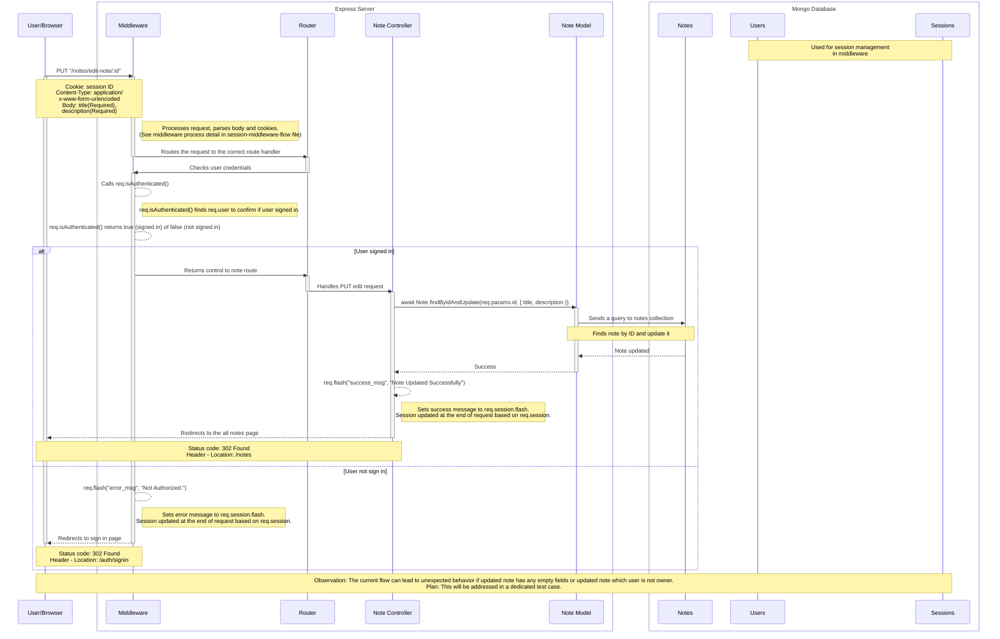

```mermaid
%%PUT edit form request

sequenceDiagram
    participant U as User/Browser

    box Express Server
    participant M as Middleware
    participant R as Router
    participant NC as Note Controller
    participant MD as Note Model
    end

    box Mongo Database
    participant N as Notes
    participant Us as Users
    participant S as Sessions
    end

    note over Us, S: Used for session management<br/>in middleware

    %%flow
    %%send request
    U ->> M: PUT "/notes/edit-note/:id"
    activate U
    activate M
    note over U, M: Cookie: session ID<br/>Content-Type: application/<br/>x-www-form-urlencoded<br/> Body: title(Required),<br/>description(Required)

    %%middleware process
    note right of M: Processes request, parses body and cookies.<br/>(See middleware process detail in session-middleware-flow file)

    M ->> R: Routes the request to the correct route handler
    deactivate M
    activate R

    %route handler
    R ->> M: Checks user credentials
    deactivate R
    activate M
    M --> M: Calls req.isAuthenticated()
    note right of M: req.isAuthenticated() finds req.user to confirm if user signed in.
    M --> M: req.isAuthenticated() returns true (signed in) of false (not signed in)

    alt User signed in
        M ->> R: Returns control to note route
        activate R
        R ->> NC: Handles PUT edit request
        deactivate R
        activate NC
        NC ->> MD: await Note.findByIdAndUpdate(req.params.id, { title, description })
        activate MD
        MD ->> N: Sends a query to notes collection
        note over MD, N: Finds note by ID and update it
        N -->> MD: Note updated
        MD -->> NC: Success
        deactivate MD
        NC -->> NC: req.flash("success_msg", "Note Updated Successfully")
        note right of NC: Sets success message to req.session.flash.<br/> Session updated at the end of request based on req.session.
        NC -->> U: Redirects to the all notes page
        deactivate NC
        note over NC, U: Status code: 302 Found<br/>Header - Location: /notes

    else User not sign in
        M --> M: req.flash("error_msg", "Not Authorized.")
        note right of M: Sets error message to req.session.flash.<br/>Session updated at the end of request based on req.session.
        M -->> U: Redirects to sign in page
        deactivate M
        deactivate U
        note over M, U: Status code: 302 Found<br/>Header - Location: /auth/signin
        
    end

    note over U, S: Observation: The current flow can lead to unexpected behavior if updated note has any empty fields or updated note which user is not owner.<br/>Plan: This will be addressed in a dedicated test case.

```