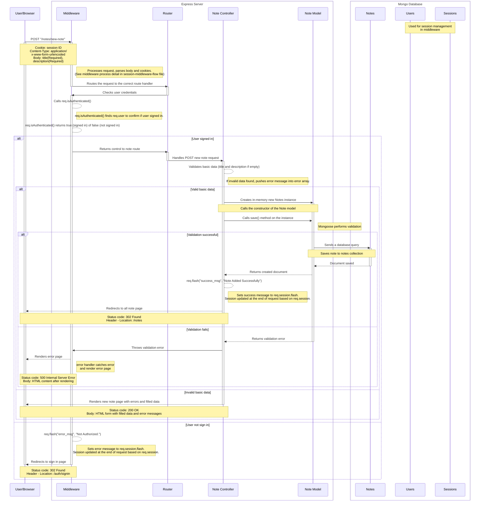

```mermaid
%%POST new note form request

sequenceDiagram
    participant U as User/Browser

    box Express Server
    participant M as Middleware
    participant R as Router
    participant NC as Note Controller
    participant MD as Note Model
    end

    box Mongo Database
    participant N as Notes
    participant Us as Users
    participant S as Sessions
    end

    note over Us, S: Used for session management<br/>in middleware

    %%flow
    %%send request
    U ->> M: POST "/notes/new-note"
    activate U
    activate M
    note over U, M: Cookie: session ID<br/>Content-Type: application/<br/>x-www-form-urlencoded<br/> Body: title(Required),<br/>description(Required)

    %%middleware process
    note right of M: Processes request, parses body and cookies.<br/>(See middleware process detail in session-middleware-flow file)

    M ->> R: Routes the request to the correct route handler
    deactivate M
    activate R

    %route handler
    R ->> M: Checks user credentials
    deactivate R
    activate M
    M --> M: Calls req.isAuthenticated()
    note right of M: req.isAuthenticated() finds req.user to confirm if user signed in.
    M --> M: req.isAuthenticated() returns true (signed in) of false (not signed in)

    alt User signed in
        M ->> R: Returns control to note route
        activate R
        R ->> NC: Handles POST new note request
        deactivate R
        activate NC
        NC --> NC: Validates basic data (title and description if empty)
        note right of NC: If invalid data found, pushes error message into error array.

        alt Valid basic data
           NC ->> MD: Creates in-memory new Notes instance
           activate MD
           note over NC, MD: Calls the constructor of the Note model
           NC ->> MD: Calls save() method on the instance
           note right of MD: Mongoose performs validation

           alt Validation successful
               MD ->> N: Sends a database query
               activate N
               note over MD, N: Saves note to notes collection
               N -->> MD: Document saved
               deactivate N
               MD -->> NC: Returns created document
               NC --> NC: req.flash("success_msg", "Note Added Successfully")
               note right of NC: Sets success message to req.session.flash.<br/> Session updated at the end of request based on req.session.
               NC -->> U: Redirects to all note page
               note over NC, U: Status code: 302 Found<br/>Header - Location: /notes

            else Validation fails
               MD -->> NC: Returns validation error
               deactivate MD
               NC ->>  M: Throws validation error
               M -->> U: Renders error page
               note right of M: error handler catches error<br/> and render error page
               note over M, U: Status code: 500 Internal Server Error<br/>Body: HTML content after rendering
            end
               
        else Invalid basic data
             NC -->> U: Renders new note page with errors and filled data
             deactivate NC
             note over NC, U: Status code: 200 OK<br/>Body: HTML form with filled data and error messages
        end
    else User not sign in
        M --> M: req.flash("error_msg", "Not Authorized.")
        note right of M: Sets error message to req.session.flash.<br/>Session updated at the end of request based on req.session.
        M -->> U: Redirects to sign in page
        deactivate M
        deactivate U
        note over M, U: Status code: 302 Found<br/>Header - Location: /auth/signin
        
    end

```