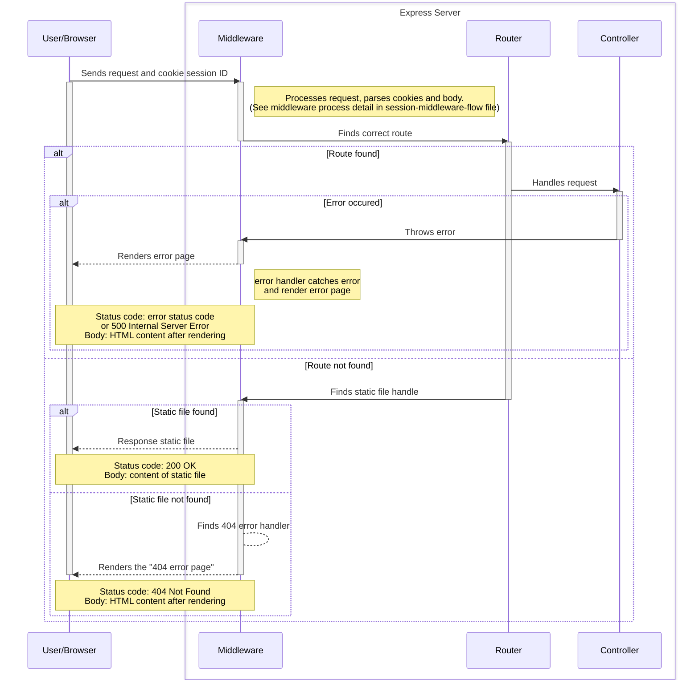

```mermaid
%% error, static file and 404 handler

sequenceDiagram
    participant U as User/Browser

    box Express Server
    participant M as Middleware
    participant R as Router
    participant C as Controller
    end
    
    %%flow
    %%send request
    U ->> M: Sends request and cookie session ID
    activate U
    activate M

    %%middleware process
    note right of M: Processes request, parses cookies and body.<br/>(See middleware process detail in session-middleware-flow file)

    M ->> R: Finds correct route
    deactivate M
    activate R
    alt Route found
        R ->> C: Handles request
        activate C
        alt Error occured
            C ->> M: Throws error
            activate M
            deactivate C
            M -->> U: Renders error page
            deactivate M
            note right of M: error handler catches error<br/> and render error page
            note over M, U: Status code: error status code<br/>or 500 Internal Server Error<br/>Body: HTML content after rendering
        end

    else Route not found
         R ->> M: Finds static file handle
         deactivate R
         activate M

         alt Static file found
             M -->> U: Response static file
             note over M, U: Status code: 200 OK<br/>Body: content of static file
         else Static file not found
             M --> M: Finds 404 error handler
             M -->> U: Renders the "404 error page"
             deactivate M
             deactivate U
             note over M, U: Status code: 404 Not Found<br/>Body: HTML content after rendering
        end
    end 
    
```