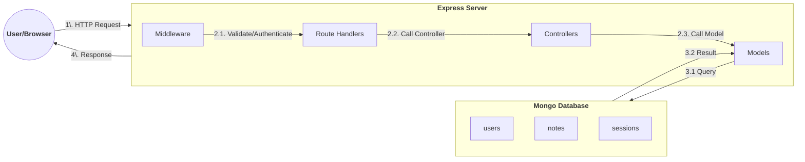

```mermaid

flowchart LR
    A(("<b>User/Browser")) -- "1\. HTTP Request" --> E
    E -- "4\. Response" --> A
    subgraph E["<b>Express Server"]
        direction TB
        E1["Middleware"]
        E2["Route Handlers"]
        E3["Controllers"]
        E4["Models"]
    end
    subgraph D["<b>Mongo Database"]
        direction TB
        D1["users"]
        D2["notes"]
        D3["sessions"]
    end

    %% Server flow
    E1 -- "2.1. Validate/Authenticate" --> E2
    E2 -- "2.2. Call Controller" --> E3
    E3 -- "2.3. Call Model" --> E4

    %% Database flow
    E4 -- "3.1 Query" --> D
    D -- "3.2 Result" --> E4
```