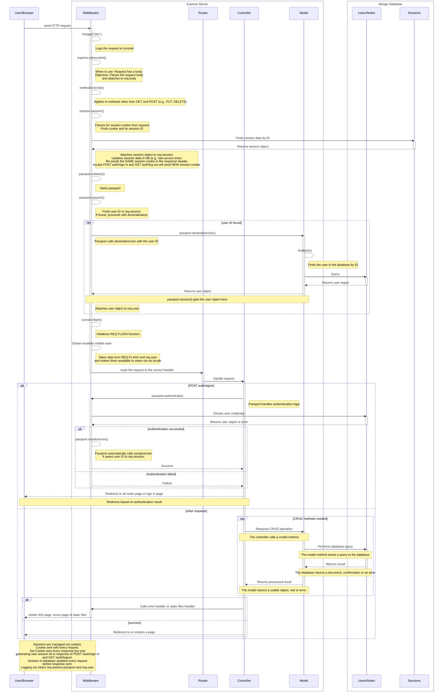

```mermaid
sequenceDiagram
    participant U as User/Browser

    box Express Server
    participant M as Middleware
    participant R as Router
    participant C as Controller
    participant MD as Model
    end

    box Mongo Database
    participant UN as Users/Notes
    participant S as Sessions
    end

    %%flow
    %%send request
    U ->> M: send HTTP request
    activate M

    %%middleware process
    M --> M: morgan("dev")
    note right of M: Logs the request to console

    M --> M: express.urlencoded()
    note right of M: When to use: Request has a body.<br/> Objective: Parses the request body <br/> and attaches to req.body

    M --> M: methodOverride()
    note right of M: Applies to methods other than GET and POST (e.g., PUT, DELETE)

    M --> M: express-session()
    note right of M: Checks for session cookie from request.<br/>Finds cookie and its session ID.

    M ->> S: Finds session data by ID
    activate S
    S -->> M: Returns session object
    deactivate S

    note right of M: Attaches session object to req.session.<br/>Updates session data in DB (e.g., last access time).<br/>Re-sends the SAME session cookie in the response header,<br/>except POST auth/sign in and GET auth/log out will send NEW session cookie.

    M --> M: passport.initialize()
    note right of M: Starts passport

    M --> M: passport.session()
    note right of M: Finds user ID in req.session. <br/> If found, proceeds with deserialization.

    opt user ID found
    
    M ->> MD: passport.deserializeUser()
    activate MD
    note right of M: Passport calls deserializeUser with the user ID.

    MD --> MD: findByID()
    note right of MD: Finds the user in the database by ID.

    MD ->> UN: Query
    activate UN

    UN -->> MD: Returns user object
    deactivate UN

    MD -->> M: Returns user object
    note over MD, M: passport.session() gets the user object here
    deactivate MD
    note right of M: Attaches user object to req.user.
    end

    M --> M: connect-flash()
    note right of M: Initializes REQ.FLASH function.

    M --> M: Global variables middle ware
    note right of M: Takes data from REQ.FLASH and req.user<br/>and makes them available to views via res.locals
    M ->> R: route the request to the correct handler
    deactivate M
    activate R

    %%main routing

    R ->> C: Handle request
    deactivate R
    activate C

    alt POST auth/signin
    C ->> M: passport.authenticate()
    activate M
    note right of C: Passport handles authentication logic
    

    M ->> UN: Checks user credential
    activate UN
    UN -->> M: Returns user object or error
    deactivate UN

      alt Authentication successful
      M --> M: passport.serializeUser()
      note right of M: Passport automatically calls serializeUser.<br/>It saves user ID to req.session.
      M -->> C: Success
      else Authentication failed
      M -->> C: Failure
      end
      deactivate M
    C -->> U: Redirects to all notes page or sign in page
    note over C, U: Redirects based on authentication result

    else other requests
      opt CRUD methods needed
      C ->> MD: Requests CRUD operation
      activate MD
      note over C, MD: The controller calls a model method
      MD ->> UN: Performs database query
      activate UN
      note over MD, UN: The model method sends a query to the database
      UN -->> MD: Returns result
      note over UN, MD: The database returns a document, confirmation or an error
      deactivate UN
      MD -->> C: Returns processed result
      note over MD, C: The model returns a usable object, null or error.
      deactivate MD
      end

      alt
      C ->> M: Calls error handler or static files handler
            activate M
            M -->> U: render 404 page, errors page of static files
            deactivate M
      else success
        C -->> U: Redirects to or renders a page
        end
    end

    deactivate C

    note over M, U: Sessions are managed via cookies.<br/>Cookie sent with every request.<br/>Set-Cookie sent every response but only<br/> generating new session ID in response of POST /auth/sign in<br/> and GET /auth/logout.<br/>Session in database updated every request <br/>before response sent.<br/>Logging out clears req.session.passport and req.user.


```